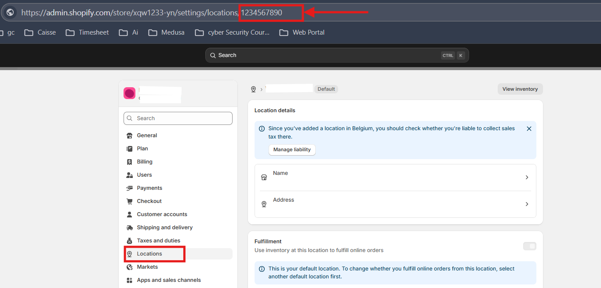

## CLD to Shopify Sync

A Node.js service for synchronizing products, stock, and orders between a CLD system and Shopify. Built with NestJS, mysqlite
Prisma, and cron jobs for automated syncing.

---

## 🚀 Features

- **Product Sync:**    Sync products from CLD to Shopify, avoiding duplicates.
- **Stock Sync:**      Keep Shopify inventory up-to-date with CLD stock levels.
- **Order Sync:**      Placing Shopify orders to CLD Dropship order Api, and update fulfillment status.
- **Logging:**         Track all sync actions for products, stock, and orders.
- **Scheduled Jobs:**  Automated syncing via cron.

---

## 🗂️ Project Structure

```
src/
  cld/         # CLD integration & DTOs
  shopify/     # Shopify integration & DTOs
  sync/        # Sync logic & controllers
  logger/      # Logging service & controller
prisma/        # Prisma schema & migrations
scripts/       # Utility scripts
.env.example   # Example environment variables
```

---

## ⚡ Getting Started

1. **Install dependencies**
   ```sh
   npm install
   ```

2. **Configure environment**
   - Copy `.env.example` to `.env` and fill in your credentials.

## - **How to add .env** 
  
  1. SHOPIFY_STORE=<your_shopify_store_id.myshopify.com>
    
    Example, where to get store id
     
     Copy store id from the URL of shopify store then paste it on .env SHOPIFY_STORE= replace with your_shopify_store_id,
     
     looks like
    SHOPIFY_STORE=<xqw1233-yn.myshopify.com>
 
  2. Add Shopify store id in Shopify API URL too
   
    SHOPIFY_API_URL=<https://your_shopify_store_id.myshopify.com>
    
    Now it will look like 
    SHOPIFY_API_URL=<https://xqw1233-yn.myshopify.com>

  3. SHOPIFY_ACCESS_TOKEN=<your_shopify_access_token>
  
     Get an Admin API access token for a single store (custom app)4. In the Shopify store admin go to **Settings → Apps and sales channels → Develop apps** (or _Develop apps_ directly).
    
    . **Create a custom app**, configure the Admin API scopes you need.

   # scope you have to enable
    
    write_products, read_products,
    write_orders, read_orders,
    write_inventory, read_inventory,
    write_locations, read_locations,
    write_assigned_fulfillment_orders, read_assigned_fulfillment_orders,
    write_fulfillments, read_fulfillments,
    write_customers, read_customers,
    write_merchant_managed_fulfillment_orders, read_merchant_managed_fulfillment_orders, write_third_party_fulfillment_orders, read_third_party_fulfillment_orders, write_custom_fulfillment_services, read_custom_fulfillment_services
    
    Click **Install app** in the custom app UI. After install, go to **API credentials / Admin API access token** and **Reveal token** — copy and save it immediately (it’s shown only once).
 
  4. . SHOPIFY_LOCATION_ID=<your_shopify_location_id>
 
   ##  🛠  **Locations**
   
    1. Log in to your **Shopify Admin**.
    
    2. Go to **Settings → Locations**.
    
    3. Click on the location you want (e.g., Your Warehouse_).
    
    4. Look at the **URL in your browser** — it will look like this:
    
    `https://{your-store}.myshopify.com/admin/settings/locations/{location_id}`
    
     👉 The number at the end of the URL is your **location ID**.
         Copy it and paste in .env SHOPIFY_LOCATION_ID

     

  5. CLD_API_URL=<cld_api_url>
     Cld will provide you Api url

  6. CLD_USERNAME=<your_cld_username>
    cld login username
 
  7. CLD_PASSWORD=<your_cld_password>
    cld login password

  8. CLD_API_KEY=<your_cld_api_key>
     - Log in to **CLD Dashboard → Profile Settings → API Key → Create Key**.
     -  Copy & paste it into `.env`.
     


  9. CRON_SEND_ALL_PRODUCTS=<true or false>
     - if it's True it will auto sync cld product to your Shopify Store. 

  
 10. CRON_SYNC_STOCK=<true or false>
     - it will update cld product stock to you shopify store
  
 11. CRON_ORDERS_TO_CLD=<true or false>
     - it will place shopify order to cld.

 12. RUN_BOOTSTRAP_SYNC=<true or false>
     - If RUN_BOOTSTRAP_SYNC=true → runs handleOrdersSync() and handleStockSync() right after app starts.
     - If RUN_BOOTSTRAP_SYNC=false (or not set) → skips them on startup.
---

## Run Data base

6. **Run database migrations**
   ```sh
   npx prisma migrate dev
   ```
   

7. **Start the server**
   ```sh
   npm run start
   ```

---

## 🛠️ Test manually execution via API's

- **Sync products:** `POST /shopify/send-all-products`
- **Sync stock:** `GET /shopify/sync-stock`
- **Sync orders:** `GET /shopify/orders-to-cld`
- **View logs:**  
  - Products: `GET /logger/products`  
  - Stock: `GET /logger/stocks`  
  - Orders: `GET /logger/orders`

---

## 🧪 Testing

```sh
npm run test
```

---


## Deploying on Production

cd /var/www/

git clone https://github.com/cerkutayalp/cld-to-shopify-sync.git

cd /var/www/cld-to-shopify-sync

npm i

npm i pm2

npm ci

npx prisma generate

npx prisma migrate dev --name init_logger

npm run build

pm2 start ecosystem.config.js --env production

pm2 logs


## 📄 License

MIT

---

## 🙏 Contributing

Pull requests are welcome! For major changes, please open an issue first to discuss what you would like to change.

---

## 📞 Support

For questions or support, open an issue or contact the maintainer.
